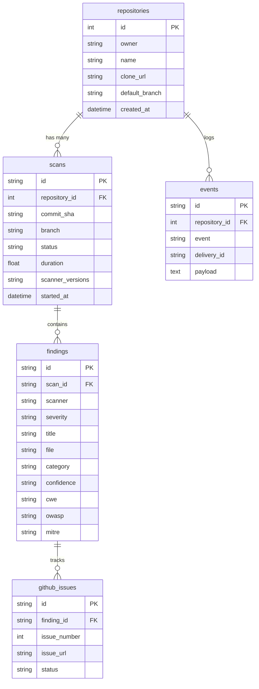

# 🛡️ SecureGuard GitHub App

[](https://github.com/NATTOMR/secureguard-github-app/actions/workflows/ci.yml)
[](https://www.python.org/downloads/)
[](https://fastapi.tiangolo.com/)
[](LICENSE)

**SecureGuard** is an enterprise-grade, open-source GitHub App built with Python & FastAPI that automatically performs **Secret Detection** and **Static Application Security Testing (SAST)** whenever code is pushed or a Pull Request is opened in your repositories.

---

## ✨ Features

- **🔑 Dual Authentication Engine**: Built-in GitHub App RS256 JWT generator and Installation Access Token exchange service with automatic in-memory caching.
- **🕵️ Secret Detection**: Scans for leaked AWS Keys, GitHub Tokens, JWTs, Stripe/Slack API keys, and exposed `.env` files.
- **🔬 SAST & OWASP Top 10 Scanning**: Detects Code Injections (`eval`, `exec`), Unsafe Deserialization (`pickle.loads`), SQL Injection patterns, XSS (`innerHTML`), and weak cryptography.
- **⚡ Dual-Engine Fallback**: Runs Semgrep CLI if installed, with a high-performance native Python pattern matching fallback.
- **🤖 GitHub Automation**:
  - Posts Markdown security reports as Pull Request review comments or commit status comments.
  - Automatically creates GitHub Issues for **CRITICAL** and **HIGH** severity findings with built-in deduplication (`secureguard` label).
- **🔒 Security First**: Masking of secrets in logs, non-root Docker execution, and safe temporary workspace cleanup.

---

## 🏗️ Architecture Overview

```
                        ┌────────────────────────┐
                        │   GitHub Webhook /     │
                        │    POST /scan          │
                        └───────────┬────────────┘
                                    │
                                    v
                        ┌────────────────────────┐
                        │   FastAPI App Router   │
                        └───────────┬────────────┘
                                    │
                                    v
                        ┌────────────────────────┐
                        │   ScanService          │
                        │   Orchestrator         │
                        └─────┬────────────┬─────┘
                              │            │
             ┌────────────────┘            └────────────────┐
             v                                              v
┌──────────────────────────┐                    ┌──────────────────────────┐
│  GitleaksScanner         │                    │  SemgrepScanner          │
│  (Secret Detection)      │                    │  (SAST & OWASP Top 10)   │
└──────────────────────────┘                    └──────────────────────────┘
             │                                              │
             └────────────────┬─────────────────────────────┘
                              │
                              v
                        ┌────────────────────────┐
                        │ GitHubNotification     │
                        │ Service                │
                        ├────────────────────────┤
                        │ ‣ ReportService        │
                        │ ‣ CommentService       │
                        │ ‣ IssueService         │
                        └────────────────────────┘
```

---

## 🚀 Quick Start

### 1. Local Environment Setup

```bash
# Clone the repository
git clone https://github.com/NATTOMR/secureguard-github-app.git
cd secureguard-github-app

# Create virtual environment
python -m venv .venv
source .venv/bin/activate  # On Windows: .venv\Scripts\activate

# Install dependencies
pip install -r requirements.txt

# Create environment configuration
cp .env.example .env
```

### 2. Configure Environment Variables (`.env`)

```env
APP_NAME=SecureGuard
ENV=development
DEBUG=True
PORT=8000

GITHUB_APP_ID=4492546
GITHUB_CLIENT_ID=Iv23liZQ44TRV62qhhYj
GITHUB_WEBHOOK_SECRET=your_webhook_secret_here
GITHUB_PRIVATE_KEY_PATH=keys/private-key.pem
```

### 3. Run Application

```bash
# Start FastAPI application with Uvicorn
uvicorn app.main:app --reload --host 127.0.0.1 --port 8000
```

Access Swagger UI interactive docs at: [http://127.0.0.1:8000/docs](http://127.0.0.1:8000/docs)

---

## 🐳 Running with Docker

### Using Docker Compose

```bash
# Build and run the app container
docker-compose up --build -d

# View application logs
docker-compose logs -f

# Stop the container
docker-compose down
```

### Using Standalone Docker

```bash
# Build image
docker build -t secureguard-app .

# Run container
docker run -d -p 8000:8000 --env-file .env --name secureguard secureguard-app
```

---

## 🌐 API Endpoints Reference

| Method | Endpoint | Description |
| :--- | :--- | :--- |
| `GET` | `/` | Root application metadata |
| `GET` | `/health` | Application health check endpoint |
| `GET` | `/auth/status` | GitHub App authentication configuration status |
| `GET` | `/auth/test` | Live authentication check against GitHub API |
| `POST` | `/scan` | Initiate a dual security scan (Secrets + SAST) and trigger GitHub automation |
| `POST` | `/webhook` | GitHub Webhook listener endpoint |

### Example Scan Request (`POST /scan`)

```bash
curl -X POST "http://127.0.0.1:8000/scan" \
     -H "Content-Type: application/json" \
     -d '{
           "owner": "octocat",
           "repo": "Hello-World",
           "commit_sha": "7fd1a60b01f91b314f59955a4e4d4e80d8edf11d",
           "pr_number": 42,
           "notify_github": true
         }'
```

### Example GitHub Webhook Event (`push`)

```json
Header: X-GitHub-Event: push
Header: X-Hub-Signature-256: sha256=...

{
  "ref": "refs/heads/main",
  "after": "7fd1a60b01f91b314f59955a4e4d4e80d8edf11d",
  "repository": {
    "name": "Hello-World",
    "owner": { "login": "octocat" }
  },
  "installation": { "id": 123456 }
}
```

### Example Security Report (GitHub Issue Body)

```markdown
# SecureGuard Security Report

## Summary
Critical: 1
High: 0
Medium: 0
Low: 0

## Findings
**Severity:** CRITICAL
**File:** `config/settings.py`
**Line:** 14
**Rule:** `aws-access-key`
**Description:** Found potential AWS Access Key ID
```

### Example Pull Request Review Bot Comment

```markdown
# 🛡 SecureGuard Security Review

## Summary

| Severity | Count |
|----------|------:|
| Critical | 0 |
| High | 1 |
| Medium | 1 |
| Low | 0 |

---

## Findings

### 🔴 High

**Hardcoded GitHub Token**

File:
app/config.py

Line:
18

Recommendation:

Move token to environment variables.

---

### 🟡 Medium

**subprocess(shell=True)**

File:
utils.py

Recommendation:

Avoid shell=True.
```

### Example GitHub Check Run Output

```markdown
Title: SecureGuard Security Scan
Summary:
### Repository scanned successfully.

| Severity | Count |
|----------|------:|
| Critical | 0 |
| High | 2 |
| Medium | 3 |
| Low | 1 |

Text:
## 🟠 High Findings
**Hardcoded GitHub Token**
- **File:** `app/config.py` (Line 18)
- **Rule:** `github-token`
- **Description:** Sensitive credential detected.
- **Recommendation:** Move token into GitHub Secrets.
```

---

## 📊 Enterprise Web Dashboard

Access the live interactive web dashboard at: [http://127.0.0.1:8000/dashboard](http://127.0.0.1:8000/dashboard)

### 🗄️ Database ER Diagram



---

## 🌐 API Endpoints Reference

| Method | Endpoint | Description |
| :--- | :--- | :--- |
| `GET` | `/` | Root application metadata |
| `GET` | `/health` | Application health check endpoint |
| `GET` | `/dashboard` | Interactive Web Dashboard UI |
| `GET` | `/api/dashboard` | Dashboard metric cards and severity overview |
| `GET` | `/api/dashboard/history` | Paginated scan history timeline data |
| `GET` | `/api/dashboard/trends` | Weekly security findings trend over time |
| `GET` | `/api/dashboard/leaderboard` | Repository risk score leaderboard ranking |
| `GET` | `/api/dashboard/common-vulnerabilities` | Most frequently occurring vulnerability rule IDs |
| `GET` | `/api/dashboard/scanner-usage` | Security scanner distribution statistics |
| `GET` | `/api/dashboard/weekly-stats` | 7-day aggregate DevSecOps activity metrics |
| `GET` | `/api/repositories` | Scanned repositories with risk score calculation |
| `GET` | `/api/scans` | Full scan execution history |
| `GET` | `/api/findings` | Filterable findings (by severity, scanner, status) |
| `GET` | `/api/events` | Webhook delivery audit logs |
| `GET` | `/api/github/issues` | List tracked GitHub Issue records |
| `POST` | `/api/github/issues/create` | Manually create GitHub Issue for a vulnerability |
| `GET` | `/api/github/issues/{id}` | Retrieve single GitHub Issue record details |
| `GET` | `/api/export/sarif/{scan_id}` | Download GitHub Code Scanning compatible SARIF 2.1.0 JSON |
| `GET` | `/api/export/pdf/{scan_id}` | Download CISO executive PDF security report |
| `GET` | `/api/export/html/{scan_id}` | Download standalone HTML security report |
| `GET` | `/api/ai/health` | Active AI provider health check |
| `GET` | `/api/ai/providers` | List available registered AI providers |
| `POST` | `/api/ai/analyze` | AI vulnerability analysis with attack scenarios and CVSS/OWASP mapping |
| `POST` | `/api/ai/fix` | AI secure code remediation generator (Python, JS, TS, Go, Java, Docker, Terraform) |
| `POST` | `/api/ai/report` | AI CISO executive security report generator |
| `POST` | `/api/ai/chat` | Interactive security chat assistant |

### 🧠 AI Vulnerability Analysis Engine Categories

- 🔑 **Secrets Scanner Prompt**: Hardcoded API keys, OAuth tokens, git history cleanup.
- ⚡ **SAST Scanner Prompt**: Injection flaws, XSS, unsafe deserialization, insecure crypto.
- 📦 **Dependency SCA Prompt**: Vulnerable open-source packages and CVE upgrade paths.
- 🐳 **Container Prompt**: Dockerfile misconfigurations, root privilege execution, base image risks.
- 🏗️ **IaC Prompt**: Terraform, CloudFormation, and Kubernetes security policy enforcement.

---

## 🧪 Running Tests

```bash
# Run pytest test suite
python -m pytest tests/ -v

# Run with test coverage report
python -m pytest tests/ --cov=app --cov-report=term-missing
```

---

## 📜 License

Distributed under the MIT License. See `LICENSE` for details.
